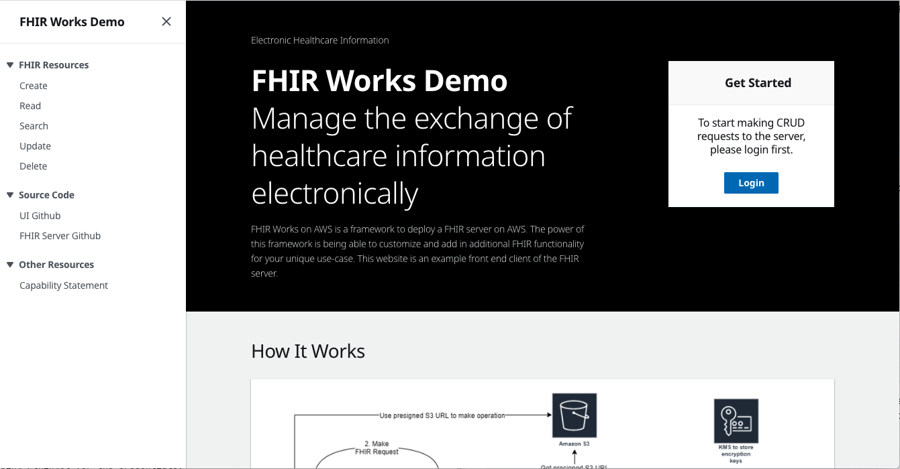
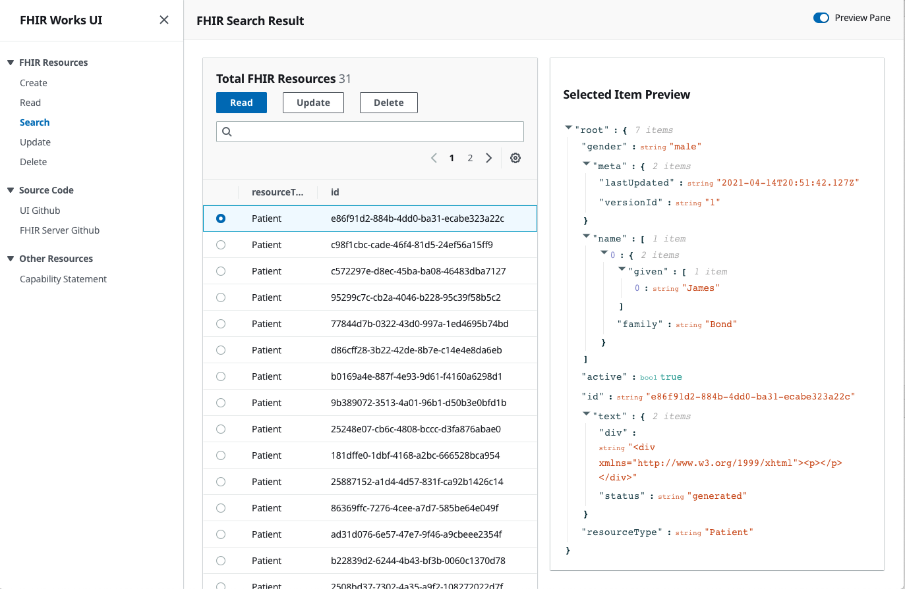

# Smart Digital Health UI

Based on [AWS FHIR Works On AWS UI](https://github.com/awslabs/fhir-works-on-aws-ui)

This code base allows you to spin up a UI that makes it easy and simple to interface with the [FHIR Works on AWS Server](https://github.com/awslabs/fhir-works-on-aws-deployment).


**Home Page**



**Search Results**

## Installation
To get started, we will need a FHIR Server for the UI to connect to. We will need the FHIR Server to have `CORS` enabled so that the UI can connect to it. You can spin up your own FHIR Server by deploying the FHIR Works on AWS code on the [enable-cors](https://github.com/awslabs/fhir-works-on-aws-deployment/tree/enable-cors) branch.
Follow the steps below to get started

1. Deploy a FHIR Server with `CORS` enabled by following the instructions [here](https://github.com/awslabs/fhir-works-on-aws-deployment/tree/enable-cors)

2. After the FHIR Server has been deployed run `serverless info --verbose` to grab the FHIR Server credentials. Make note of the output, specifically the outputs listed below

```
Service Information
region: <REGION>
api keys:
  developer-key-kev: <REACT_APP_API_KEY>

Stack Outputs
UserPoolAppClientId: <REACT_APP_CLIENT_ID>
ServiceEndpoint: <REACT_APP_FHIR_SERVER_URL>
```

3. Create a file in the root directory of this project named `.env.local`. The file should be on the path `fhir-works-frontend/.env.local`. You should store the FHIR Server credentials in the file as shown below. Remember to replace the variable values with the actual value from the step above.

```
REACT_APP_FHIR_SERVER_URL=https://h9azbbark2.execute-api.ap-southeast-2.amazonaws.com/dev
REACT_APP_AUTH_URL=https://33k0ggv7odoroau0ht7h6e5s70.auth.ap-southeast-2.amazoncognito.com
REACT_APP_CLIENT_ID=33k0ggv7odoroau0ht7h6e5s70
REACT_APP_API_KEY=pjrhskWU8M2el8QGKbPJH8VvwUo33a9Z3XGi973I
```

4. You are now ready to spin up your FHIR UI. If you don't already have `yarn`, please follow the instructions [here](https://classic.yarnpkg.com/en/docs/install/) to install it. After installing yarn, run the commands below to spin up the FHIR UI.

```
npm install
npm start
```

5. Once `yarn start` has completed, go to `localhost:3000` on your browser to see the website. The first thing you want to do is to `login` to the FHIR server on the home page. Click login and follow the instructions. By default the FHIR Server sets up the following username/password.

```
username: workshopuser
password: Master123!
```

## Deploy using AWS Amplify

- Please following instructions outlined in the following [README](./amplify-infra/README.md) file

## Security

- If you're running the FHIR UI on your local machine, the access token that is being passed from Cognito to the FHIR UI is over `http`. This is not a secure connection. With that in mind, don't store any private information on the FHIR Server. The FHIR Server should be a test server with only fake data.
- To enable secure connection to the FHIR Server from the FHIR UI, you will need to set up a secure domain with a SSL Certificate for the FHIR UI. Note, a secure domain will have the `https` prefix. After setting up the secure domain for the FHIR UI, remember to add the FHIR UI's web address to the list of allowed `Redirect URLs` in `Cognito`.
